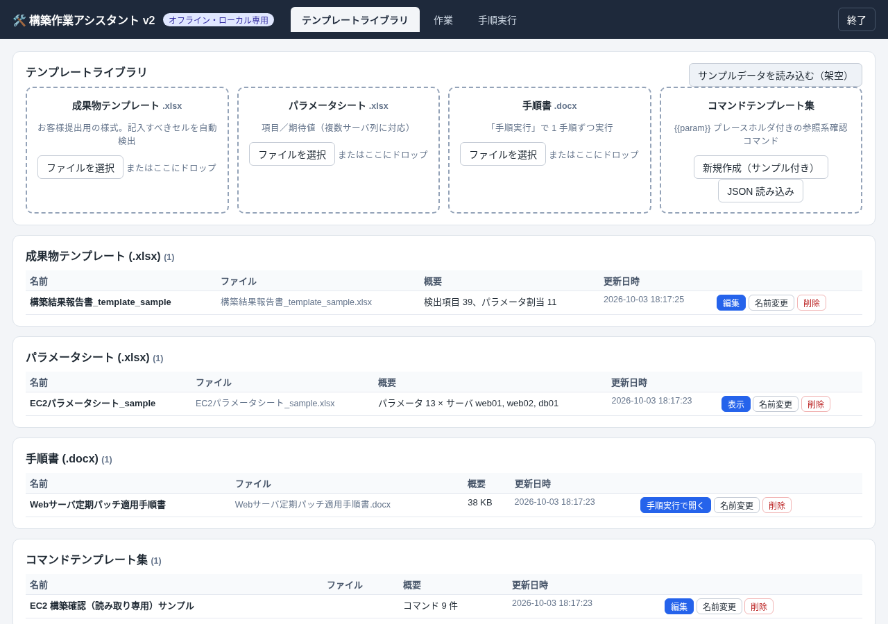

# 構築作業アシスタント v2

完全オフライン・ローカル専用の構築作業支援ツールです。Excel 成果物テンプレートの入力欄検出と自動記入、入力チェック、パラメータシートとの比較、参照系確認コマンドの生成、Word 手順書の 1 手順ずつの実行（v1 SOP Runner を統合）を 1 つにまとめています。

> このリポジトリには汎用コードと**架空のサンプルデータ**（example.local / 192.0.2.x / 198.51.100.x / 架空の ID）のみ含まれます。実際のテンプレート・パラメータシート・作業データはコミットしないでください（`data/` は `.gitignore` で除外済み）。



## 動作環境
- Windows 10/11（macOS / Linux も可）、**Python 3.8 以上**（管理者権限・`pip install` は不要）
- ブラウザ：Edge / Chrome / Firefox のいずれか
- ネットワーク不要。`127.0.0.1` のみで待ち受け、外部への通信は一切行いません。

## 起動方法
1. GitHub から ZIP をダウンロードして展開（または `git clone`）。
2. Windows は **`start.bat`** をダブルクリック。macOS は `start.command`、Linux は `./start.sh`。
3. ブラウザで `http://127.0.0.1:8765/` が自動で開きます（ポート使用中の場合は自動で別ポートを使用し、黒い画面に URL を表示します）。
4. 終了：画面右上の「終了」ボタン、または黒い画面で `Ctrl+C`。

コマンドラインオプション：`python app.py --port 8765 --data-dir D:\work\ba-data --no-browser`

## 使い方
1. **テンプレートライブラリ**に登録します。
   - 成果物テンプレート（お客様提出用の .xlsx）→ 記入すべきセルを自動検出
   - パラメータシート（.xlsx：行 = 項目、列 = サーバ）
   - 手順書（.docx）
   - コマンドテンプレート集（新規作成または JSON 読み込み）
   - まずは「サンプルデータを読み込む（架空）」で試せます。
2. **成果物テンプレートの編集**：「参照パラメータシート」を選び「ラベルで自動マッピング」。検出項目ごとにラベル・型（テキスト/数値/リスト/日付）・選択肢・必須・書式（IP、インスタンス ID など）・正規表現・最小/最大・値の取得元（作業入力／パラメータのキー／固定値／記入しない）を調整して「保存」。上部グリッドのセルをクリックすると検出漏れを追加できます。
3. **作業**：テンプレート・パラメータシート・対象サーバ（パラメータシートの列）・コマンドテンプレート集・手順書を選んで作業を作成します。
   - ① 入力チェック：ルール違反の値はリアルタイムで赤く表示。パラメータシート側の値も同じルールでチェックします。
   - ② コマンド生成：`{{キー}}` をパラメータ値で置換した参照系の確認コマンドを生成。コピー、`.sh` / `.ps1` のダウンロードが可能。**ツールがコマンドを実行することはありません。**
   - ③ パラメータ比較：コマンドの結果を「実測値」に入力すると期待値との不一致を自動表示。項目ごとに OK / NG を押し、.xlsx で出力できます。
   - ④ 最終値チェック：パラメータシートの要求値、① 作業入力、③ 実測値、手順実行の入力値を同じキーでまとめ、最終値を ③ と同じ判定ルールで照合します（下記）。「作業入力値一覧 PDF」もここから出力できます。
   - ⑤ 成果物出力：既知の値をお客様テンプレートに記入して .xlsx を出力（書式は維持）。個別の記述は Excel で手修正してください。「証跡画像を挿入する」にチェックすると、手順実行で添付した画像も挿入できます（下記）。最終値に不一致・食い違いがある場合は出力前に確認ダイアログを表示します（「このまま出力する」で続行可能）。
4. **手順実行**：v1 SOP Runner（手順の分割・結合、入力が揃うまで確認不可、備考・異常フラグ、Word 実施記録）。進捗はローカルの `data/` フォルダに保存されます。

### カスタム証跡画像
- **設定（編集モード）**：任意の手順の「＋ 証跡画像を要求」で画像の要求を追加します。1 手順に複数追加でき、それぞれに説明（例：「EC2 詳細画面のスクリーンショット」）と任意のキー（Excel 用、例：`img_ec2`）を付けられます。
- **ライブラリへの保存**：手順書をテンプレートライブラリから開いた場合、要求の設定は自動的にその手順書に保存され、次に同じ手順書を読み込むと再適用されます（手順名で対応付け、見つからなければ同じ位置の手順）。ライブラリ未登録の手順書は「ライブラリに登録して設定を保存」で登録できます。
- **実行**：要求のある手順には添付欄が表示されます。**Ctrl+V でクリップボードのスクリーンショットを貼り付け**、ドラッグ＆ドロップ、「ファイルを選択」（PNG / JPEG）のいずれでも添付できます。貼り付け先は選択中（クリックした）欄、未選択なら最初の未添付の欄です。サムネイルのクリックで拡大（Esc で閉じる）、✕ で削除。
- **確認の条件**：必須入力に加え、すべての要求に画像が 1 枚以上添付されるまで「確認」は押せません。
- **保存**：画像ファイルは `data/sop_images/`、セッション JSON にはメタデータ（ID・サイズ・ファイル名）のみ保存します（localStorage に画像は入りません）。再読み込み・再開後もそのまま表示されます。
- **Word 実施記録**：各手順の行の下に、説明のキャプション付きで画像を埋め込みます（表の幅に合わせて縮小、縦は 1 ページに収まる高さまで）。
- **Excel 成果物（任意）**：⑤ 成果物出力で「証跡画像を挿入する」にチェックし、記録を選んで出力すると、末尾に「証跡」シートを追加して手順ごとに画像を貼り付けます。テンプレート編集で取得元を「証跡画像（キー指定）」にしたセルには、そのキーの最初の画像を配置します（結合セルなど十分な大きさがあれば範囲内に縮小）。Pillow は使わず純 Python で画像パーツを書き出します（openpyxl の描画出力に画像バイトを直接渡す `ba/images.py`）。

### 最終値チェック（④）
- **手順書の入力項目にキーを付ける**：手順実行の編集モードで、入力項目の「キー」欄にパラメータのキー（例：`instance_type`、`worker`）を入力します。候補はパラメータシートのキーとテンプレートの入力項目のキーから表示されます。ライブラリから開いた手順書では、キーは証跡画像の設定と一緒に保存され、次回も再適用されます（入力項目のラベルで対応付け）。
- **作業と手順実行の記録を紐付ける**：④ 最終値チェックの「手順実行の記録」で記録を選びます（`job.sop_key`。作業の手順書と同じファイルの記録は「候補を紐付ける」で 1 クリック）。
- **集約と判定**：同じキーの値を 1 行にまとめます。最終値は入力日時が最も新しい値（同時刻なら 手順実行 → ③ → ① の順）で、要求値があれば ③ と同じ判定ルール（`compare.judge`）で「一致／不一致」を判定します。同じ項目に入力元ごとに異なる値があれば「食い違い」です（日付は表記が違っても同じ日なら同じ値とみなします）。不一致・食い違いの行は赤く表示し、各入力元の値・入力元（手順/ページ）・入力日時を一覧できます。書式チェック（書式エラー）は ① の入力値に対して行います。
- **入力日時**：① の入力と ③ の実測値は値が変わったときに、手順実行の入力値は入力したときに記録します。以前のデータ（日時なし）もそのまま読み込めます（手順実行は確認日時で代用）。

### 作業入力値一覧 PDF
- ④ または ⑤ の「作業入力値一覧 PDF」ボタンで、入力のある項目の最終値を一覧にした A4 横の PDF を作成し、成果物と同じ `data/exports/` に保存します。列：項目名／最終値／要求値／判定／入力元（手順/ページ）／入力日時。見出しにサーバ名・作業日・作業者（キー `work_date` / `worker`、無ければ手順実行の記録）を表示します。フォントは Meiryo / Yu Gothic UI などの OS 標準フォントのみ使用します。
- PDF は印刷用 HTML を **Microsoft Edge のヘッドレス印刷**（`msedge --headless --print-to-pdf`）で変換します。Edge は App Paths（レジストリ）、`Program Files (x86)` / `Program Files`、`PATH` の順に自動検出し、無ければ Chrome / Chromium を使います（macOS / Linux も同様に検出）。環境変数 `BA_PDF_BROWSER` でブラウザのパスを指定できます（`none` で無効）。
- ブラウザが見つからない・失敗した・90 秒以内に終わらない場合は、印刷用ページを開くダイアログを表示します。「印刷 / PDF に保存」ボタンから PDF にしてください（用紙は A4 横に設定済み）。

## 検出ルール（成果物テンプレート）
| 検出理由 | 条件 |
|---|---|
| プレースホルダ | セルに `{{name}}`、`＿＿＿`、`___`、`（　）`、`【　】` を含む |
| 入力規則 | データの入力規則あり：リスト → リスト選択（`"A,B"`、同一/別シートの範囲、名前の定義に対応）、整数/小数 → 数値（最小/最大つき） |
| 塗りつぶし | 空セルで、白以外の塗りつぶしがある |
| ラベル横の空欄 | 空セルで罫線あり（または左のラベルが「：」で終わる）、左 6 列以内に文字ラベルがある |

ラベル = 左側の最も近い文字（行ラベル）＋ 上の見出し（列見出し。「設定値/値/内容」などの汎用語は省略）。「備考/メモ/コメント」列は既定で任意・記入しない。型の推定：日付書式や「作業日」など → 日付、数値書式や「GiB/サイズ/vCPU」など → 数値。書式プリセットはラベルから推定します（IP → IPv4、インスタンスID → `i-…`、AMI、サブネット、SG、ホスト名など）。

## データの保存場所
`data/` フォルダ（app.py と同じ場所）：`library/`（登録したファイル + meta.json）、`jobs/*.json`、`sop_sessions/*.json`、`sop_images/`（証跡画像）、`exports/`（出力ファイル）。バックアップ・移行は `data/` ごとコピーしてください。

## セキュリティ
- 127.0.0.1 のみにバインド。Host ヘッダを検証し、起動ごとにランダムなトークンを発行して API 呼び出しに必須とします（他のサイトからの呼び出しを防止）。
- 画面のリソースはすべてローカル。CSP で外部リソースの読み込みを禁止。外部通信がないことをテストで確認しています。
- 生成コマンドはテキストのみ。パラメータ値に特殊文字があれば自動でクォート。`--no-cli-pager`・`--output`・`-o BatchMode=yes` の不足、リソースを変更する aws サブコマンド、対話型プログラム、`rm`/`shutdown` などは警告します。

## 既知の制限
- openpyxl で保存するため、成果物テンプレート内の**画像・グラフ・図形・テキストボックス・マクロ（.xlsm 非対応）**、一部の高度な条件付き書式/スライサーは保持されません。
- 検出はヒューリスティックです。罫線のない様式、縦書きラベル、複数行にまたがる複雑な見出しは編集画面で補正してください。
- 1 つの作業はパラメータシートの 1 サーバに対応します（複数サーバは作業を分けて作成）。
- 比較の「実測値」はコマンド出力からのコピー＆ペーストです（コマンドの自動実行や出力の解析はしません）。
- 手順実行モジュールの制限は v1 と同じです（複雑な Word レイアウト、結合セルなど）。
- 証跡画像は PNG / JPEG のみ（1 枚 20 MB まで）。手順書を編集して手順名と位置の両方が変わると、保存済みの要求は再適用されません。セッションを削除しても画像ファイルは `data/sop_images/` に残ります（手動で削除してください）。
- Excel への画像挿入は「証跡」シート／指定セルへの配置のみで、印刷レイアウトの細かな調整はしません。
- 最終値は「入力日時が最も新しい値」です。日時のない以前のデータは、日時のある値より古いものとして扱います。作業と手順実行の記録の紐付けは手動です（候補表示あり）。
- 手順書の「入力を再検出」を行うと、その手順の入力項目のキーは消えます（再設定してください）。キーを付けていない手順実行の入力値は「ラベル（手順 n）」の行として一覧・PDF に載りますが、要求値との照合は行いません。
- PDF の自動作成は Windows 版 Edge を想定していますが、開発環境では Linux の Chrome / Chromium で検証しています。Edge のポリシーでヘッドレス起動が禁止されている環境では印刷用ページで代替してください。

## 開発者向け

```
app.py                 起動スクリプト（vendor/ を sys.path に追加、http.server 起動、ブラウザを開く）
ba/                    バックエンド（標準ライブラリ + openpyxl）
  server.py            127.0.0.1 の HTTP サーバ、トークン/Host 検証、ルーティング
  service.py           業務ロジック（テストからも直接呼び出し）
  xlsx_detect.py       成果物テンプレートの検出、自動マッピング、グリッドプレビュー
  paramsheet.py        パラメータシートの解析
  rules.py / rules_presets.json   入力ルール（web/js/rules.js と同一ロジック）
  compare.py           比較判定、.xlsx 出力
  values.py            最終値チェック（キーでの集約、判定、食い違い検出）
  report.py            作業入力値一覧の印刷用 HTML、Edge/Chrome の検出、ヘッドレス PDF 変換
  commands.py          コマンド生成、lint、クォート、.sh/.ps1
  fill.py              成果物への書き込み（書式維持）、証跡画像の挿入
  images.py            PNG/JPEG のサイズ読み取り、Pillow 不要の画像オブジェクト
  store.py             data/ 配下の JSON 保存
web/                   フロントエンド（素の HTML/JS/CSS、CDN なし）
  js/app.js            テンプレートライブラリ / 作業 画面
  js/rules.js          ブラウザ側のルールと判定
  sop/                 v1 SOP Runner（tools/sync_from_v1.py で同期・パッチ・日本語化）
  sop/sop-evidence.js  カスタム証跡画像（v2 独自。sop-app.js / export.js にはフック経由で接続）
  vendor/jszip.min.js
vendor/                openpyxl 3.1.5 + et_xmlfile 2.0.0（純 Python）
samples/               架空サンプル + make_samples.py
tests/                 unittest、JS 一致テスト、E2E（Playwright、開発者用）
```

テスト：`sh tests/run_all.sh`（単体テストは Python のみで実行可。E2E は Node.js + Playwright が必要で、開発者用です）。
`tests/test_no_chinese.py` は画面に出る文言に簡体字・中国語の語が混入していないことを検査します。

License: MIT（vendor 内の各ライブラリはそれぞれのライセンスに従います）。

<!-- zh-dev -->
## 开发者备注（中文）

- UI、提示信息、导出标签、生成脚本注释、启动脚本输出全部为日语；`tests/test_no_chinese.py` 会扫描 web/、ba/*.py、app.py、启动脚本和本 README 的日语部分，发现简体字或中文特有词即失败。
- v1（/workspace/sop-runner）保持不变；v2 中的 `web/sop/*` 由 `tools/sync_from_v1.py` 生成，日语化替换表在 `tools/v1_ja.py`（每条替换都会断言匹配次数）。
- 代码注释中仍有部分中文，不会显示在界面上。
- 最终值一致性：`ba/values.py`（collect → evaluate → summary），`Service.all_values(job)`；手顺输入的键 `inp.key` 由 sync_from_v1.py 补丁加入，`results[].valuesAt` 记录输入时间；库里按标签保存在 `evidence.steps[].inputKeys`。PDF：`ba/report.py`（find_browser 可注入 platform/env/winreg 便于测试，html_to_pdf 使用临时 user-data-dir）。
- 证迹图片：`web/sop/sop-evidence.js` 通过 `window.SopHooks`（sync_from_v1.py 注入的钩子）接入；export.js 增加了 `ExportHooks.stepRows` 和 `pack(meta.extend)`。Excel 侧在 `ba/fill.py:add_evidence`，不依赖 Pillow。
